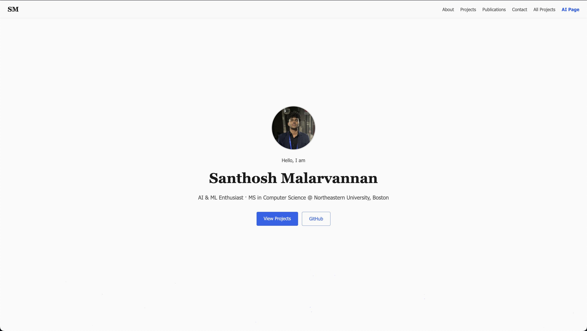
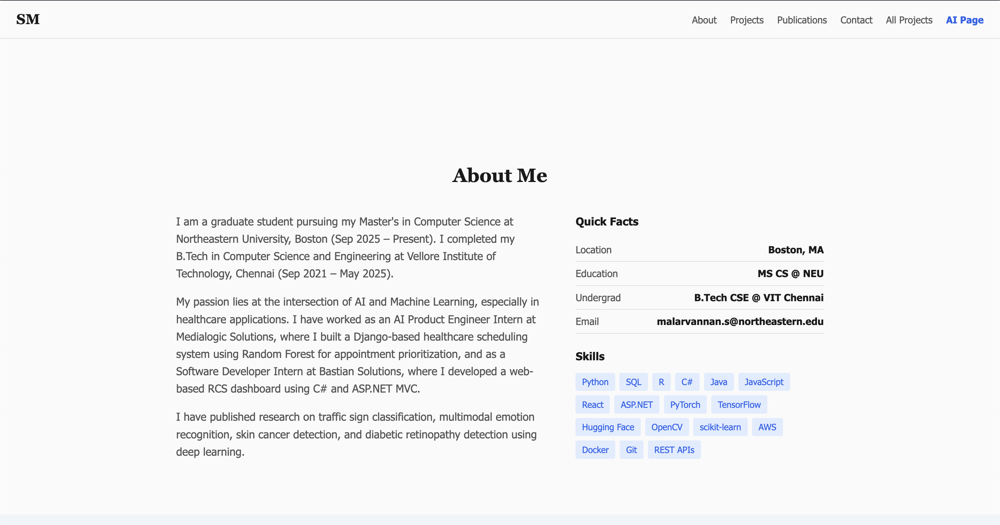
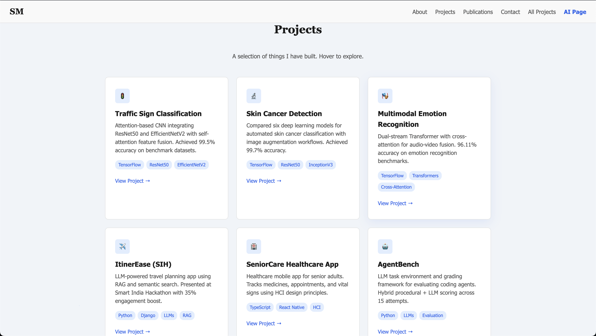
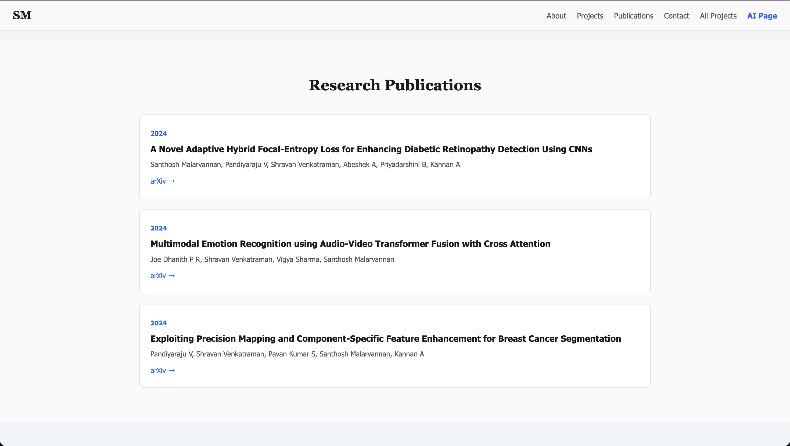
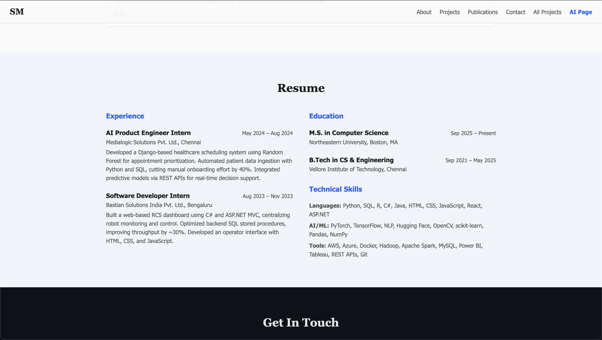
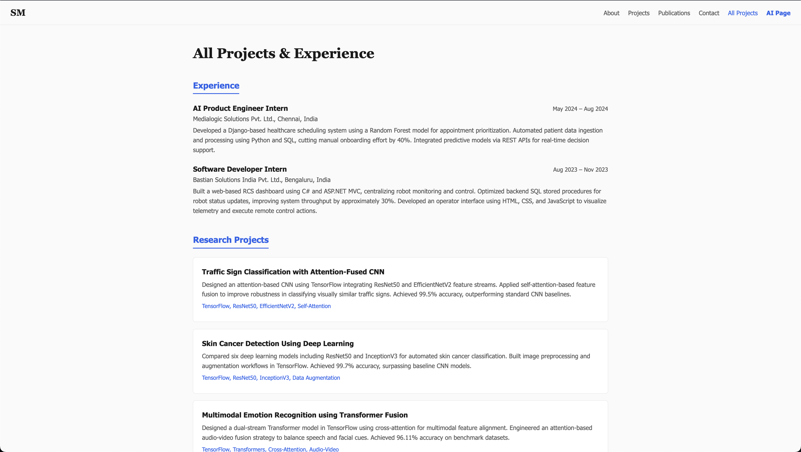
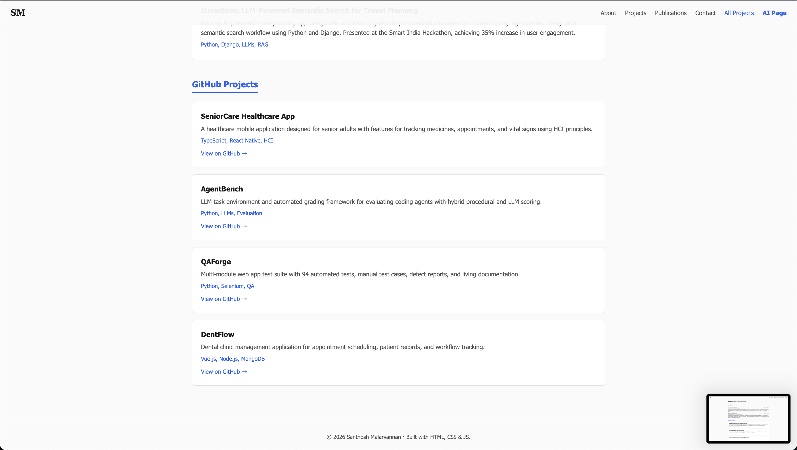
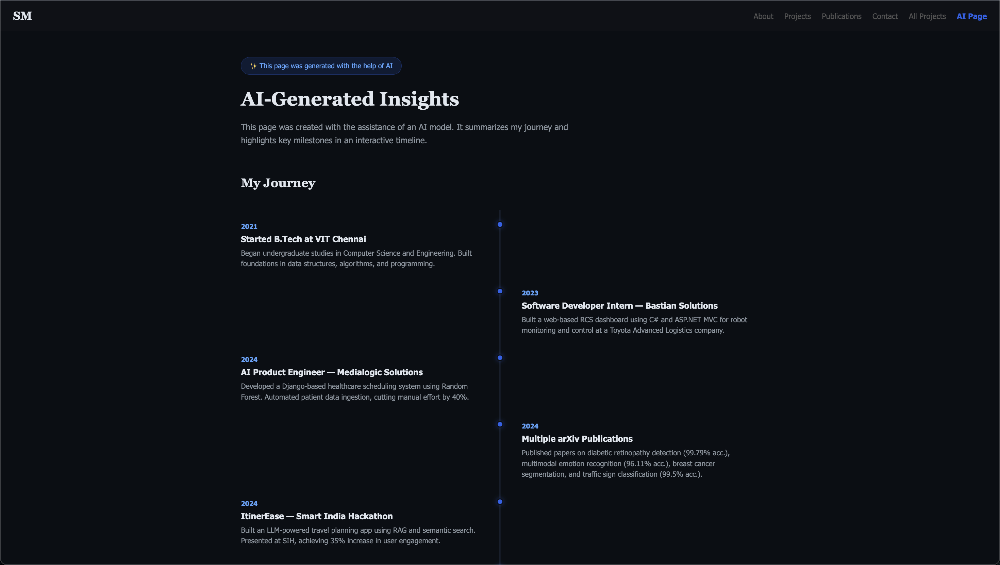
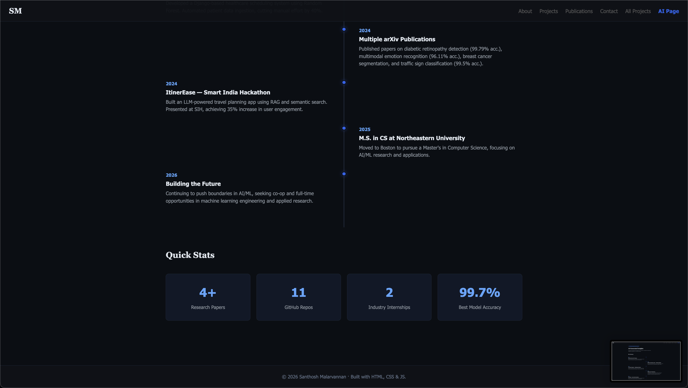

# Santhosh Malarvannan — Personal Homepage

## Author

Santhosh Malarvannan

## Class Link

[CS 5010 / Web Development — Northeastern University, Boston](https://johnguerra.co/classes/webDevelopment_online_summer_2026/)

## Project Objective

A personal homepage built with vanilla HTML5, CSS3, and ES6+ modules (no frameworks or libraries). The site showcases my background, research publications, work experience, projects, and contact information. The original creative component is the **Projects section** on the homepage — project cards are dynamically rendered from a JS data array, appear with staggered fade-in animations via IntersectionObserver, and the background has floating particle dots spawned by JS and animated with CSS keyframes.

## Screenshots











## Live Demo

[https://sandy055.github.io/santhosh-homepage/](https://sandy055.github.io/santhosh-homepage/)

## Demo Video

[Link to narrated video demonstration](#)

## Project Structure

```
├── index.html              (main homepage)
├── projects.html           (all projects & experience)
├── ai.html                 (AI-generated insights page)
├── package.json
├── eslint.config.js
├── .prettierrc
├── .gitignore
├── LICENSE
├── README.md
├── css/
│   ├── style.css
│   └── ai.css
├── js/
│   ├── main.js
│   ├── nav.js
│   ├── projects.js
│   └── particles.js
├── images/
│   └── favicon.svg
└── docs/
    └── DESIGN_DOCUMENT.md
```

## Instructions to Build

1. Clone the repository:
   ```bash
   git clone https://github.com/Sandy055/santhosh-homepage.git
   cd santhosh-homepage
   ```
2. Install dev dependencies (for linting and formatting):
   ```bash
   npm install
   ```
3. Open `index.html` directly in a browser, or serve locally:
   ```bash
   npx serve .
   ```
4. Lint JavaScript:
   ```bash
   npm run lint
   ```
5. Format code with Prettier:
   ```bash
   npm run format
   ```

## Use of GenAI

GenAI tools were used in a limited capacity during this project.

- **AI-Generated Page:** The `ai.html` page (the third required page) was generated with the help of AI, as required by the assignment. It contains a timeline of my journey and quick stats, and is clearly labeled with a badge stating it was generated with AI assistance.
- **Brainstorming & Planning:** I used Claude (Anthropic, claude.ai) as a brainstorming tool to discuss ideas for structuring the homepage, explore different ways to present my projects and publications, and organize my thoughts for the design document (personas, user stories, mockups).
- **README & Documentation:** Claude helped me draft and organize the README structure and the design document outline.
- **Terminal Commands:** I used Claude to look up terminal commands for setting up the project, running Prettier/ESLint, and deploying to GitHub Pages.
- **All code, styling, and design decisions** for the main homepage (`index.html`) and projects page (`projects.html`) were written and implemented by me. The AI was not used to generate the HTML, CSS, or JavaScript for these pages.
- **Model:** Claude (Anthropic), accessed via claude.ai, May 2026.

## License

MIT — see [LICENSE](LICENSE).
